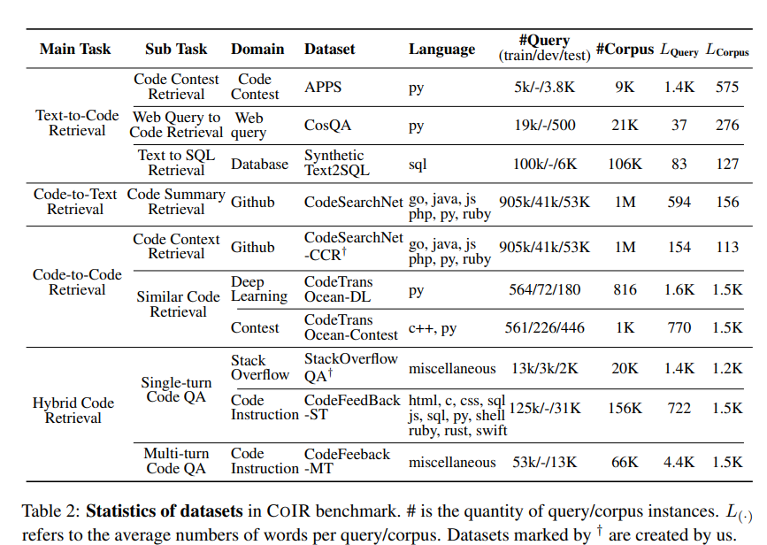

<h1 align="center">

</h1>

<p align="center">
    <a href="https://www.python.org/">
            
    </a>
    <a href="https://github.com/CoIR-team/coir/blob/main/LICENSE">
        
    </a>
    <a href="https://colab.research.google.com/drive/1CSNOdb8h0o-ToRNntIzGjONVdYmVPY2M">
        
    </a>
    <a href="https://github.com/CoIR-team/coir">
        
    </a>
</p>

<div style="margin: 30px; padding: 20px; background-color: #f9f9f9; border-radius: 10px; box-shadow: 0 2px 8px rgba(0,0,0,0.1); font-family: 'Helvetica Neue', Helvetica, Arial, sans-serif;">
  <h2 style="font-size: 36px; font-weight: bold; color: #333; margin-bottom: 20px;">💥 Impact</h2>
  <p style="font-size: 20px; color: #555; margin-bottom: 15px;">CoIR has been trusted by many teams including:</p>
  <ul style="list-style: none; padding: 0;">
    <li style="font-size: 22px; margin-bottom: 12px;">
      <a href="https://huggingface.co/Salesforce/SFR-Embedding-Code-2B_R" target="_blank" style="color: #3366cc; text-decoration: none; font-weight: bold;">Salesforce</a>
    </li>
    <li style="font-size: 22px; margin-bottom: 12px;">
      <a href="https://blog.voyageai.com/2024/12/04/voyage-code-3/" target="_blank" style="color: #3366cc; text-decoration: none; font-weight: bold;">Voyage</a>
    </li>
    <li style="font-size: 22px; margin-bottom: 12px;">
      <a href="https://huggingface.co/Alibaba-NLP/gte-modernbert-base" target="_blank" style="color: #3366cc; text-decoration: none; font-weight: bold;">GTE</a>
    </li>
    <li style="font-size: 22px; margin-bottom: 12px;">
      <a href="https://huggingface.co/spaces/mteb/leaderboard" target="_blank" style="color: #3366cc; text-decoration: none; font-weight: bold;">NV-Embed</a>
    </li>
    <li style="font-size: 22px; margin-bottom: 12px;">
      <a href="https://huggingface.co/spaces/mteb/leaderboard" target="_blank" style="color: #3366cc; text-decoration: none; font-weight: bold;">OpenAI</a>
    </li>
     <li style="font-size: 22px; margin-bottom: 12px;">
      <a href="https://huggingface.co/spaces/mteb/leaderboard" target="_blank" style="color: #3366cc; text-decoration: none; font-weight: bold;">Google</a>
    </li>
  </ul>
</div>


# News
**Feb 18, 2025** 🎉 Congratulations to **Salesforce** for Achieving the First Rank on the [CoIR Leaderboard](https://archersama.github.io/coir/)!

**Sep 13, 2024** 🎉  We are pleased to announce that the CoIR Leadboard is now available on the [MTEB leaderboard](https://huggingface.co/spaces/mteb/leaderboard). You can now submit your results on the MTEB [MTEB](https://huggingface.co/spaces/mteb/leaderboard) or [CoIR](https://archersama.github.io/coir/) Leaderboard. 🚀

**Sep 12, 2024** 🎉  We are pleased to announce that the **[month download count](https://huggingface.co/CoIR-Retrieval)** of CoIR has surpassed that of CodeSearchNet, establishing it as one of the most popular code retrieval benchmarks within the community. 🚀

**August 22, 2024** 🎉 We are pleased to announce that our work has been integrated into the [**MTEB** (Massive Text Embedding Benchmark)](https://github.com/embeddings-benchmark/mteb). You can now use the MTEB framework to evaluate CoIR datasets. 🚀

[Learn how to use MTEB with our datasets](#coconut-mteb-usage)

**July 10 , 2024** 🎉 We are pleased to announce that our work has been [praised](https://github.com/CoIR-team/coir/issues/4) by MTEB. 🚀


## :coconut: What is CoIR?

**CoIR** (**Co**de **I**nformation **R**etrieval) benchmark, is designed to evaluate code retrieval capabilities. CoIR includes **10** curated code datasets, covering **8** retrieval tasks across **7** domains.  In total, it encompasses two million documents. It also provides a **common and easy** Python framework, installable via pip, and shares the same data schema as benchmarks like MTEB and BEIR for easy cross-benchmark evaluations.

For **models leaderboard**, checkout out **leaderboard** page: [**CoIR Leaderboard**](https://archersama.github.io/coir/). 

For **submit your models performance to coir leaderboard**, following this [**Instruction**](https://github.com/CoIR-team/coir/issues/2).

For **submit your models performance to mteb leaderboard**, following this [**Instruction**](https://github.com/CoIR-team/coir/issues/13).

For **models and datasets**, checkout out **Hugging Face (HF)** page: [https://huggingface.co/CoIR-Retrieval](https://huggingface.co/CoIR-Retrieval).


For more information, checkout out our **publication**: [CoIR: A Comprehensive Benchmark for Code Information Retrieval Models](https://arxiv.org/abs/2407.02883)

Why the Results on the MTEB and CoIR Leaderboards **Differ**? [Look this issue](https://github.com/CoIR-team/coir/issues/17)

If you have some data  or code  or other questions ❓, welcome to submit issues or PRs 🙌.

If you find this interesting or useful, please give us a star ⭐. Your support means a lot to us and helps us continue our work 🙏.  

<div align="center">
    
    <br>
    <strong>Overview of COIR benchmark.</strong>
</div>


## :coconut: Data Availability

All data has been uploaded to our Hugging Face page: [CoIR-Retrieval](https://huggingface.co/CoIR-Retrieval)


### Statistics of datasets in coir benchmark
<div align="center">
    
    <br>
    <strong>Overview of COIR benchmark.</strong>
</div>

## :coconut: Features
- CoIR encompasses a total of ten distinct code retrieval datasets.
- CoIR supports seamless integration with Hugging Face and other libraries, enabling one-click loading and evaluation of models.
- CoIR supports custom models and API-based models, offering flexible integration options for diverse requirements.


### :coconut: Installation

Install the `coir-eval` package via pip:

```bash
pip install coir-eval
```

If you want to build from source, use:

```bash
$ git clone git@github.com:CoIR-team/coir.git
$ cd coir
$ pip install -e .
```

### :coconut: Simple Usage

If you have installed the `coir-eval` package, directly use the following code to run the evaluation:

```python
import coir
from coir.data_loader import get_tasks
from coir.evaluation import COIR
from coir.models import YourCustomDEModel

model_name = "intfloat/e5-base-v2"

# Load the model
model = YourCustomDEModel(model_name=model_name)

# Get tasks
#all task ["codetrans-dl","stackoverflow-qa","apps","codefeedback-mt","codefeedback-st","codetrans-contest","synthetic-
# text2sql","cosqa","codesearchnet","codesearchnet-ccr"]
tasks = get_tasks(tasks=["codetrans-dl"])

# Initialize evaluation
evaluation = COIR(tasks=tasks,batch_size=128)

# Run evaluation
results = evaluation.run(model, output_folder=f"results/{model_name}")
print(results)
```

You may also download this GitHub repository (`python>3.8`) and use as follows:

```python
import coir
from coir.models import YourCustomDEModel

model_name = "intfloat/e5-base-v2"

# Load the model
model = YourCustomDEModel(model_name=model_name)

# Get tasks
#all task ["codetrans-dl","stackoverflow-qa","apps","codefeedback-mt","codefeedback-st","codetrans-contest","synthetic-
# text2sql","cosqa","codesearchnet","codesearchnet-ccr"]
tasks = coir.get_tasks(tasks=["codetrans-dl"])

# Initialize evaluation
evaluation = COIR(tasks=tasks,batch_size=128)

# Run evaluation
results = evaluation.run(model, output_folder=f"results/{model_name}")
print(results)
```
### :coconut: MTEB Usage
```python
import mteb
import logging
from sentence_transformers import SentenceTransformer
from mteb import MTEB

logger = logging.getLogger(__name__)

model_name = 'intfloat/e5-base-v2'
model = SentenceTransformer(model_name)
tasks = mteb.get_tasks(
    tasks=[
        "AppsRetrieval",
        "CodeFeedbackMT",
        "CodeFeedbackST",
        "CodeTransOceanContest",
        "CodeTransOceanDL",
        "CosQA",
        "SyntheticText2SQL",
        "StackOverflowQA",
        "COIRCodeSearchNetRetrieval",
        "CodeSearchNetCCRetrieval",
    ]
)
evaluation = MTEB(tasks=tasks)
results = evaluation.run(
    model=model,
    overwrite_results=True
)
print(result)
```


### :coconut: Advanced Usage
<details>
  <summary>Click to Expand/Collapse Content</summary>
    
#### Custom Dense Retrieval Models
```python
import coir
from coir.data_loader import get_tasks
from coir.evaluation import COIR
import torch
import numpy as np
import logging
from transformers import AutoTokenizer, AutoModel
from typing import List, Dict
from tqdm.auto import tqdm

class YourCustomDEModel:
    def __init__(self, model_name="intfloat/e5-base-v2", **kwargs):
        self.tokenizer = AutoTokenizer.from_pretrained(model_name)
        self.model = AutoModel.from_pretrained(model_name).to(device)
        self.model_name = model_name
        self.tokenizer.add_eos_token = False

    def mean_pooling(self, model_output, attention_mask):
        token_embeddings = model_output[0]  # First element of model_output contains all token embeddings
        input_mask_expanded = attention_mask.unsqueeze(-1).expand(token_embeddings.size()).float()
        sum_embeddings = torch.sum(token_embeddings * input_mask_expanded, 1)
        sum_mask = torch.clamp(input_mask_expanded.sum(1), min=1e-9)
        return sum_embeddings / sum_mask

    def cls_pooling(self, model_output, attention_mask):
        # First element of model_output contains all token embeddings
        token_embeddings = model_output[0]
        # Extract the CLS token's embeddings (index 0) for each sequence in the batch
        cls_embeddings = token_embeddings[:, 0, :]
        return cls_embeddings

    def last_token_pool(self, model_output, attention_mask):
        last_hidden_states = model_output.last_hidden_state
        left_padding = (attention_mask[:, -1].sum() == attention_mask.shape[0])
        if left_padding:
            return last_hidden_states[:, -1]
        else:
            sequence_lengths = attention_mask.sum(dim=1) - 1
            batch_size = last_hidden_states.shape[0]
            return last_hidden_states[torch.arange(batch_size, device=last_hidden_states.device), sequence_lengths]

    def encode_text(self, texts: List[str], batch_size: int = 12, max_length: int = 128) -> np.ndarray:
        logging.info(f"Encoding {len(texts)} texts...")

        embeddings = []
        for i in tqdm(range(0, len(texts), batch_size), desc="Encoding batches", unit="batch"):
            batch_texts = texts[i:i+batch_size]
            encoded_input = self.tokenizer(batch_texts, padding=True, truncation=True, max_length=max_length, return_tensors="pt").to(device)
            with torch.no_grad():
                model_output = self.model(**encoded_input)
            batch_embeddings = self.mean_pooling(model_output, encoded_input['attention_mask'])
            embeddings.append(batch_embeddings.cpu())

        embeddings = torch.cat(embeddings, dim=0)

        if embeddings is None:
            logging.error("Embeddings are None.")
        else:
            logging.info(f"Encoded {len(embeddings)} embeddings.")

        return embeddings.numpy()

    def encode_queries(self, queries: List[str], batch_size: int = 12, max_length: int = 512, **kwargs) -> np.ndarray:
        all_queries = ["query: "+ query for query in queries]
        return self.encode_text(all_queries, batch_size, max_length)

    def encode_corpus(self, corpus: List[Dict[str, str]], batch_size: int = 12, max_length: int = 512, **kwargs) -> np.ndarray:
        all_texts = ["passage: "+ doc['text'] for doc in corpus]
        return self.encode_text(all_texts, batch_size, max_length)

# Load the model
model = YourCustomDEModel()

# Get tasks
#all task ["codetrans-dl","stackoverflow-qa","apps","codefeedback-mt","codefeedback-st","codetrans-contest","synthetic-
# text2sql","cosqa","codesearchnet","codesearchnet-ccr"]
tasks = coir.get_tasks(tasks=["codetrans-dl"])

# Initialize evaluation
evaluation = COIR(tasks=tasks,batch_size=128)

# Run evaluation
results = evaluation.run(model, output_folder=f"results/{model_name}")
print(results)
```
#### Using Sentence-Transformers Models
```python
import coir
from coir.data_loader import get_tasks
from coir.evaluation import COIR
import torch
import numpy as np
import logging
from sentence_transformers import SentenceTransformer
from typing import List, Dict
from tqdm.auto import tqdm

class YourCustomDEModel:
    def __init__(self, model_name="intfloat/e5-base-v2", **kwargs):
        self.model = SentenceTransformer(model_name)

    def encode_text(self, texts: List[str], batch_size: int = 12, show_progress_bar: bool = True, **kwargs) -> np.ndarray:
        logging.info(f"Encoding {len(texts)} texts...")
        
        embeddings = self.model.encode(texts, batch_size=batch_size, show_progress_bar=show_progress_bar, **kwargs)
        
        if embeddings is None:
            logging.error("Embeddings are None.")
        else:
            logging.info(f"Encoded {len(embeddings)} embeddings.")
        
        return np.array(embeddings)

    def encode_queries(self, queries: List[str], batch_size: int = 12, show_progress_bar: bool = True, **kwargs) -> np.ndarray:
        all_queries = ["query: "+ query for query in queries]
        return self.encode_text(all_queries, batch_size, show_progress_bar, **kwargs)

    def encode_corpus(self, corpus: List[Dict[str, str]], batch_size: int = 12, show_progress_bar: bool = True, **kwargs) -> np.ndarray:
        all_texts = ["passage: "+ doc['text'] for doc in corpus]
        return self.encode_text(all_texts, batch_size, show_progress_bar, **kwargs)

# Load the model
model = YourCustomDEModel()

# Get tasks
tasks = coir.get_tasks(tasks=["codetrans-dl"])

# Initialize evaluation
evaluation = COIR(tasks=tasks, batch_size=128)

# Run evaluation
results = evaluation.run(model, output_folder=f"results/{model.model_name}")
print(results)
```

#### Custom API Retrieval Models
```python
import coir
from coir.data_loader import get_tasks
from coir.evaluation import COIR
import torch
import numpy as np
import logging
from transformers import AutoTokenizer, AutoModel
from typing import List, Dict
from tqdm.auto import tqdm

class APIModel:
    def __init__(self, model_name="voyage-code-2", **kwargs):
        # Initialize the voyageai client
        self.vo = voyageai.Client(api_key="xxxx")  # This uses VOYAGE_API_KEY from environment
        self.model_name = model_name
        self.requests_per_minute = 300  # Max requests per minute
        self.delay_between_requests = 60 / self.requests_per_minute  # Delay in seco

    def encode_text(self, texts: list, batch_size: int = 12, input_type: str = "document") -> np.ndarray:
        logging.info(f"Encoding {len(texts)} texts...")

        all_embeddings = []
        start_time = time.time()
        # Processing texts in batches
        for i in tqdm(range(0, len(texts), batch_size), desc="Encoding batches", unit="batch"):
            batch_texts = texts[i:i + batch_size]
            result = self.vo.embed(batch_texts, model=self.model_name, input_type=input_type,truncation=True)
            batch_embeddings = result.embeddings  # Assume the API directly returns embeddings
            all_embeddings.extend(batch_embeddings)
            # Ensure we do not exceed rate limits
            time_elapsed = time.time() - start_time
            if time_elapsed < self.delay_between_requests:
                time.sleep(self.delay_between_requests - time_elapsed)
                start_time = time.time()

        # Combine all embeddings into a single numpy array
        embeddings_array = np.array(all_embeddings)

        # Logging after encoding
        if embeddings_array.size == 0:
            logging.error("No embeddings received.")
        else:
            logging.info(f"Encoded {len(embeddings_array)} embeddings.")

        return embeddings_array

    def encode_queries(self, queries: list, batch_size: int = 12, **kwargs) -> np.ndarray:
        truncated_queries = [query[:256] for query in queries]
        truncated_queries = ["query: " + query for query in truncated_queries]
        query_embeddings = self.encode_text(truncated_queries, batch_size, input_type="query")
        return query_embeddings


    def encode_corpus(self, corpus: list, batch_size: int = 12, **kwargs) -> np.ndarray:
        texts = [doc['text'][:512]  for doc in corpus]
        texts = ["passage: " + doc for doc in texts]
        return self.encode_text(texts, batch_size, input_type="document")

# Load the model
model = APIModel()

# Get tasks
#all task ["codetrans-dl", "stackoverflow-qa", "apps","codefeedback-mt", "codefeedback-st", "codetrans-contest", "synthetic-
# text2sql", "cosqa", "codesearchnet", "codesearchnet-ccr"]
tasks = coir.get_tasks(tasks=["codetrans-dl"])

# Initialize evaluation
evaluation = COIR(tasks=tasks, batch_size=128)

# Run evaluation
results = evaluation.run(model, output_folder=f"results/{model_name}")
print(results)
```

</details> 

## :coconut: Disclaimer

CoIR is an enhancement built on top of the BEIR framework. Compared to BEIR, CoIR supports loading models using the Hugging Face methodology, significantly simplifying the installation process. Additionally, it replaces the BEIR dependency `pytrec_eval` with `pytrec-eval-terrier`, thereby resolving the installation failures caused by the `pytrec_eval` dependency in BEIR.

If you're a dataset owner and wish to update any part of it, or do not want your dataset to be included in this library, feel free to post an issue here or make a pull request!

If you're a dataset owner and wish to include your dataset or model in this library, feel free to post an issue here or make a pull request!


## :coconut: Citing & Authors
If you find this repository helpful, feel free to cite our publication [COIR: A Comprehensive Benchmark for Code Information Retrieval Models](https://arxiv.org/abs/2407.02883):

```
@misc{li2024coircomprehensivebenchmarkcode,
      title={CoIR: A Comprehensive Benchmark for Code Information Retrieval Models}, 
      author={Xiangyang Li and Kuicai Dong and Yi Quan Lee and Wei Xia and Yichun Yin and Hao Zhang and Yong Liu and Yasheng Wang and Ruiming Tang},
      year={2024},
      eprint={2407.02883},
      archivePrefix={arXiv},
      primaryClass={cs.IR},
      url={https://arxiv.org/abs/2407.02883}, 
}
```

## :coconut: Contributors

Thanks go to all these wonderful collaborations for their contribution towards the CoIR benchmark:

<!-- ALL-CONTRIBUTORS-LIST:START - Do not remove or modify this section -->
<!-- prettier-ignore-start -->
<!-- markdownlint-disable -->
<table>
  <tr>
    <td align="center"><a href="https://github.com/archersama"><br /><sub><b>Xiangyang Li</b></sub></a></td>
    <td align="center"><a href="https://github.com/monikernemo"><br /><sub><b>Yi Quan Lee</b></sub></a></td>
    <td align="center"><a href="https://github.com/daviddongkc"><br /><sub><b>Kuicai Dong</b></sub></a></td>
    <td align="center"><a href="https://26hzhang.github.io"><br /><sub><b>Hao Zhang</b></sub></a></td>
  </tr>
</table>

<!-- markdownlint-restore -->
<!-- prettier-ignore-end -->
<!-- ALL-CONTRIBUTORS-LIST:END -->
